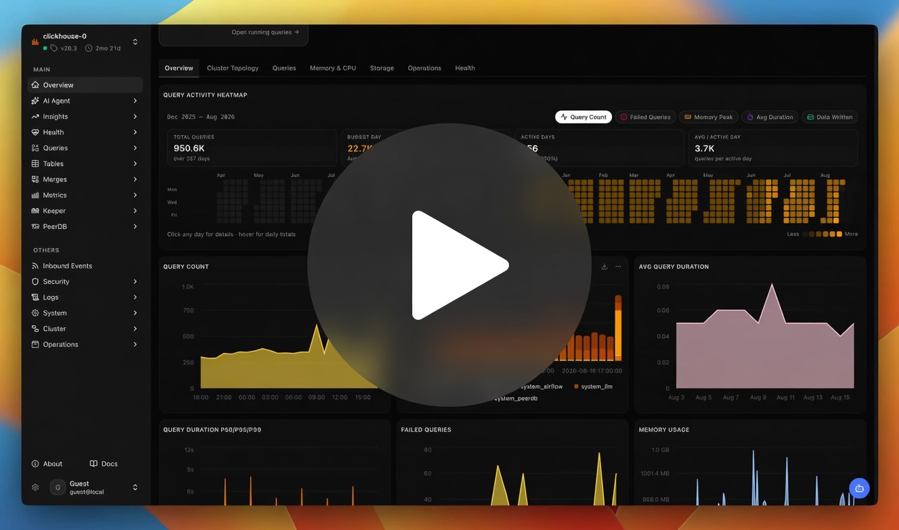
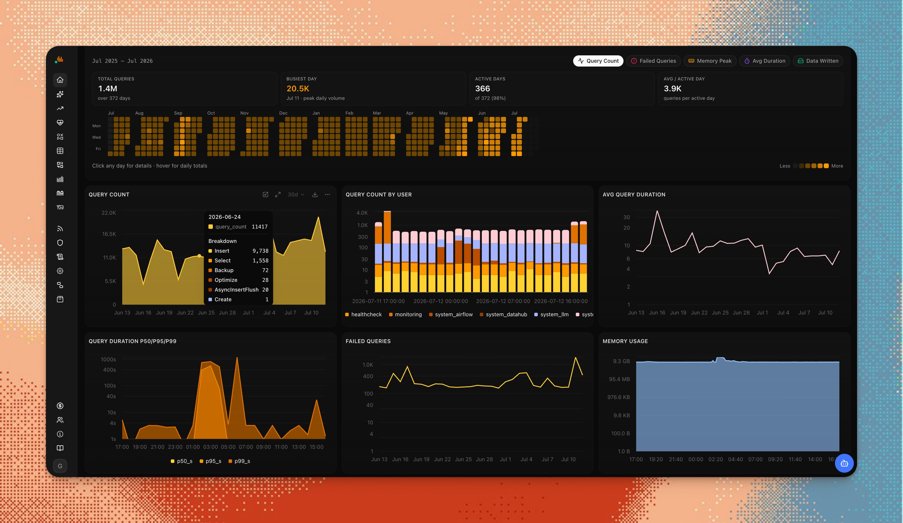
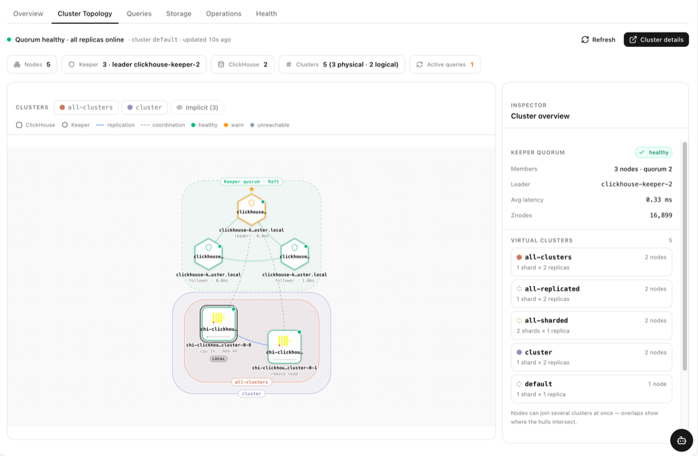
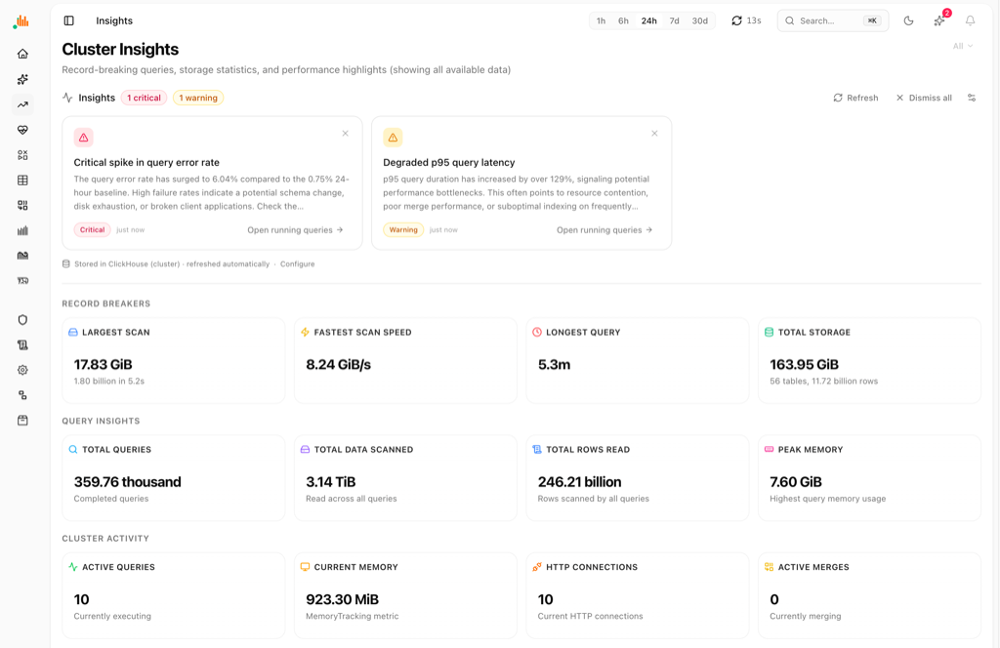
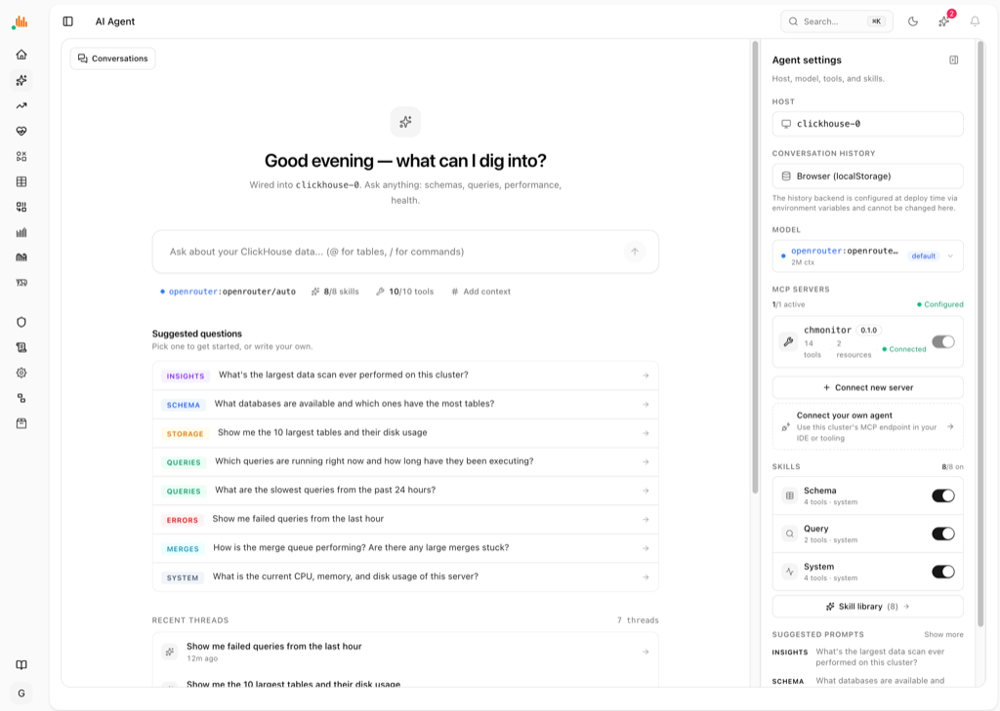
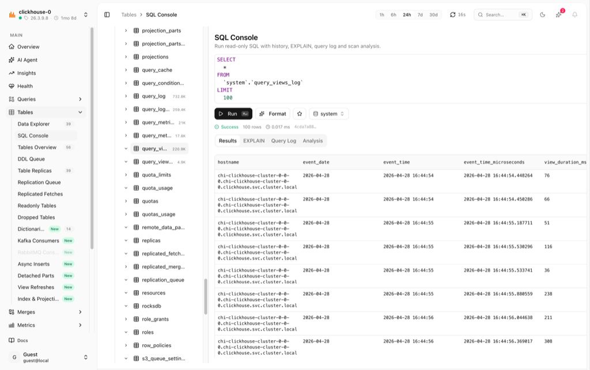

<p align="center">
  <picture>
    <source media="(prefers-color-scheme: dark)" srcset=".github/logo.png">
    
  </picture>
</p>

<h1 align="center">chmonitor</h1>
<p align="center"><strong>The operational advisor for ClickHouse</strong></p>

[](https://github.com/chmonitor/chmonitor/actions/workflows/ci.yml)
[](https://github.com/chmonitor/chmonitor/stargazers)
[](https://github.com/chmonitor/chmonitor/releases)
[](https://github.com/chmonitor/chmonitor/pkgs/container/chmonitor)
[](LICENSE)

<p align="center">
  <a href="https://dash.chmonitor.dev/overview?host=0"><strong>Live demo</strong></a>
  · <a href="https://chmonitor.dev/">Website</a>
  · <a href="https://docs.chmonitor.dev">Docs</a>
  · <a href="https://docs.chmonitor.dev/guide/getting-started">Getting started</a>
  · <a href="#quick-start">Quick start</a>
</p>

<p align="center">
  <a href="https://chmonitor.dev/watch/v0-3">
    
  </a>
</p>
<p align="center">
  <a href="https://chmonitor.dev/watch/v0-3"><strong>Watch the v0.3 launch film</strong></a>
  · 36 seconds ·
  <a href="https://chmonitor.dev/assets/videos/chmonitor-v0.3.mp4">MP4</a>
</p>

**chmonitor** is a dashboard and advisor for ClickHouse. It reads `system.*`
tables and shows what the cluster is doing — queries, merges, replication,
storage, health — then recommends what to change next.

It does **not** apply DDL for you. Recommendations stay recommendations.

Runs the same way on Docker, Kubernetes, bare metal, or ClickHouse Cloud.
Self-host it free (GPL-3.0), or use the [hosted demo](https://dash.chmonitor.dev/overview?host=0).

Current release: **[v0.3.0](https://github.com/chmonitor/chmonitor/releases/tag/v0.3.0)**.
Upgrading from v0.2? See [Migrate to v0.3](https://docs.chmonitor.dev/reference/migrating/v0-3).

---

## What it does

| You need | chmonitor |
|---|---|
| See the cluster | Overview, topology, health checks, 30+ charts |
| Catch expensive work | Running, slow, failed, and historical queries |
| Understand data | Explorer, table size, parts, compression, TTLs |
| Keep replicas healthy | Merges, mutations, replication queue, Keeper |
| Get a second opinion | AI advisor: projections, skip indexes, PREWHERE, MVs |
| Ask in English | Built-in AI agent + [MCP](https://docs.chmonitor.dev/reference/mcp-clients) for Claude / Cursor |
| Work from a terminal | [`chm` CLI](https://chmonitor.dev/cli) — live TUI and `chm doctor` |

Works with **multiple ClickHouse hosts** from one dashboard (`?host=0`).

More detail: [docs](https://docs.chmonitor.dev) · [AI agent](https://docs.chmonitor.dev/guide/ai-agent) · [editions](https://docs.chmonitor.dev/operate/advanced/editions)

---

## Quick start

One container, pointed at any reachable ClickHouse (OSS, Altinity, or ClickHouse Cloud):

```bash
docker run -d --name chmonitor -p 3000:3000 \
  -e CLICKHOUSE_HOST=https://clickhouse.example.com:8443 \
  -e CLICKHOUSE_USER=default \
  -e CLICKHOUSE_PASSWORD=change-me \
  ghcr.io/chmonitor/chmonitor:v0.3.0
```

Open **http://localhost:3000**. Pin a version tag in production; use `:latest` only if you want the rolling tip.

Want a look first? **[dash.chmonitor.dev](https://dash.chmonitor.dev/overview?host=0)** — no setup.

Install the CLI:

```bash
curl -sSf https://chmonitor.dev/install.sh | bash
chm doctor
```

---

## Deploy

Same `CLICKHOUSE_HOST` / `CLICKHOUSE_USER` / `CLICKHOUSE_PASSWORD` everywhere.

| Target | Guide |
|---|---|
| Docker | [docs/operate/deploy/docker](https://docs.chmonitor.dev/operate/deploy/docker) |
| Kubernetes (Helm) | [docs/operate/deploy/k8s](https://docs.chmonitor.dev/operate/deploy/k8s) |
| Cloudflare Workers | [docs/operate/deploy](https://docs.chmonitor.dev/operate/deploy) |
| Railway / Render / Fly | [One-click](https://docs.chmonitor.dev/operate/deploy/one-click) |
| Local development | [Getting started](https://docs.chmonitor.dev/guide/getting-started/local) |

Release artifacts (Docker image, Node standalone, Workers archive) are on the
[GitHub Releases](https://github.com/chmonitor/chmonitor/releases) page.

---

## Editions

One codebase. Community is free forever (GPL-3.0). An optional license unlocks
enterprise gates — same binary.

| | Community | Enterprise |
|---|---|---|
| Cost | Free, GPL-3.0 | [Priced by host count](https://chmonitor.dev/pricing/) |
| Where it runs | Your infra | Same |
| ClickHouse hosts | Unlimited | Personal · Team 3 · Unlimited |
| AI advisor, agent, MCP | Included | Same, plus enterprise gates |

Details: [Editions](https://docs.chmonitor.dev/operate/advanced/editions).

---

## Screenshots

<picture>
  <source media="(prefers-color-scheme: dark)" srcset=".github/screenshots/overview-with-charts-dark-with-bg.jpeg">
  
</picture>

<picture>
  <source media="(prefers-color-scheme: dark)" srcset=".github/screenshots/cluster-topology-dark.png">
  
</picture>

<picture>
  <source media="(prefers-color-scheme: dark)" srcset=".github/screenshots/cluster-insights-dark.png">
  
</picture>

<picture>
  <source media="(prefers-color-scheme: dark)" srcset=".github/screenshots/ai-agent-dark.png">
  
</picture>

<picture>
  <source media="(prefers-color-scheme: dark)" srcset=".github/screenshots/sql-console-dark.png">
  
</picture>

---

## Docs

- [Getting started](https://docs.chmonitor.dev/guide/getting-started) — ClickHouse user, system tables, first run
- [Deploy](https://docs.chmonitor.dev/operate/deploy) — Docker, Kubernetes, Workers, one-click
- [AI agent](https://docs.chmonitor.dev/guide/ai-agent) — tools, skills, env
- [MCP clients](https://docs.chmonitor.dev/reference/mcp-clients) — Claude, Cursor, and other clients
- [Environment variables](https://docs.chmonitor.dev/reference/environment-variables)
- [Connection errors](https://docs.chmonitor.dev/guide/guides/connection-errors)
- [Migrate to v0.3](https://docs.chmonitor.dev/reference/migrating/v0-3)
- Source in this repo: [`docs/content/`](docs/content/) · live site: [docs.chmonitor.dev](https://docs.chmonitor.dev)

---

## Contribute

Issues and pull requests are welcome. Agent instructions live in [`AGENTS.md`](AGENTS.md)
(`CLAUDE.md` includes that file).

## License

[GPL-3.0](LICENSE)

---


