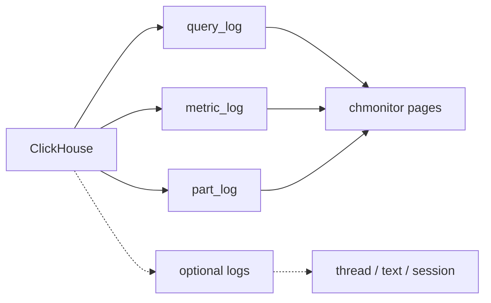

chmonitor reads from ClickHouse `system.*` log tables. Most are on in a fresh install; some deployments disable them with `<... remove="1"/>` to save disk.



## Required tables

Missing any of these degrades the corresponding pages.

| Table | What it powers | Default |
|---|---|---|
| `system.query_log` | Query history, performance, history pages | Enabled |
| `system.metric_log` | Historical CPU, memory, network | Enabled |
| `system.asynchronous_metric_log` | Periodic async metrics charts | Enabled |
| `system.part_log` | Part/merge history | Enabled |
| `system.error_log` | Server error history (v23.8+) | Enabled |

## Optional tables

Absence is graceful — empty state or a notice, not a crash.

| Table | Feature | Default | Notes |
|---|---|---|---|
| `system.query_thread_log` | Thread analysis | Disabled | Needs `log_query_threads=1` |
| `system.processors_profile_log` | Query profiler | Disabled | Explicit config |
| `system.query_views_log` | Query views log | Disabled | Explicit config |
| `system.text_log` | Server text log | Disabled | Explicit config |
| `system.session_log` | Login / session history | Disabled | Explicit config |
| `system.crash_log` | Crash log | Disabled | Explicit config |
| `system.trace_log` | Trace profiling | Disabled | Explicit config |
| `system.backup_log` | Backup/restore | Not present | Only when backup is configured |
| `system.zookeeper` | Keeper status | Not present | Only with Keeper/ZooKeeper |

## Enable the tables

<Files>
  <Folder name="etc/clickhouse-server" defaultOpen>
    <Folder name="config.d" defaultOpen>
      <File name="system-logs.xml" />
    </Folder>
    <Folder name="users.d">
      <File name="profiles.xml" />
    </Folder>
  </Folder>
</Files>

<Steps>

<Step>

### Add the config block

Create or edit `/etc/clickhouse-server/config.d/system-logs.xml`. Required blocks first; optional blocks are collapsed.

<Tabs items={['Required logs', 'Optional logs']}>
<Tab value="Required logs">

```xml
<clickhouse>
  <query_log>
    <database>system</database>
    <table>query_log</table>
    <flush_interval_milliseconds>7500</flush_interval_milliseconds>
    <max_size_rows>1048576</max_size_rows>
    <reserved_size_rows>8192</reserved_size_rows>
    <buffer_size_rows_flush_threshold>524288</buffer_size_rows_flush_threshold>
    <flush_on_crash>true</flush_on_crash>
  </query_log>

  <metric_log>
    <database>system</database>
    <table>metric_log</table>
    <flush_interval_milliseconds>7500</flush_interval_milliseconds>
    <collect_interval_milliseconds>60000</collect_interval_milliseconds>
    <max_size_rows>1048576</max_size_rows>
    <reserved_size_rows>8192</reserved_size_rows>
    <buffer_size_rows_flush_threshold>524288</buffer_size_rows_flush_threshold>
    <flush_on_crash>true</flush_on_crash>
  </metric_log>

  <asynchronous_metric_log>
    <database>system</database>
    <table>asynchronous_metric_log</table>
    <flush_interval_milliseconds>7500</flush_interval_milliseconds>
    <collect_interval_milliseconds>60000</collect_interval_milliseconds>
    <max_size_rows>1048576</max_size_rows>
    <reserved_size_rows>8192</reserved_size_rows>
    <buffer_size_rows_flush_threshold>524288</buffer_size_rows_flush_threshold>
    <flush_on_crash>true</flush_on_crash>
  </asynchronous_metric_log>

  <part_log>
    <database>system</database>
    <table>part_log</table>
    <flush_interval_milliseconds>7500</flush_interval_milliseconds>
    <max_size_rows>1048576</max_size_rows>
    <reserved_size_rows>8192</reserved_size_rows>
    <buffer_size_rows_flush_threshold>524288</buffer_size_rows_flush_threshold>
    <flush_on_crash>true</flush_on_crash>
  </part_log>

  <error_log>
    <database>system</database>
    <table>error_log</table>
    <flush_interval_milliseconds>7500</flush_interval_milliseconds>
    <collect_interval_milliseconds>1000</collect_interval_milliseconds>
    <max_size_rows>1048576</max_size_rows>
    <reserved_size_rows>8192</reserved_size_rows>
    <buffer_size_rows_flush_threshold>524288</buffer_size_rows_flush_threshold>
    <flush_on_crash>true</flush_on_crash>
  </error_log>
</clickhouse>
```

</Tab>
<Tab value="Optional logs">

Merge these into the same `<clickhouse>` root as the required blocks.

```xml
  <query_thread_log>
    <database>system</database>
    <table>query_thread_log</table>
    <flush_interval_milliseconds>7500</flush_interval_milliseconds>
    <max_size_rows>1048576</max_size_rows>
    <reserved_size_rows>8192</reserved_size_rows>
    <buffer_size_rows_flush_threshold>524288</buffer_size_rows_flush_threshold>
    <flush_on_crash>true</flush_on_crash>
  </query_thread_log>

  <processors_profile_log>
    <database>system</database>
    <table>processors_profile_log</table>
    <flush_interval_milliseconds>7500</flush_interval_milliseconds>
    <max_size_rows>1048576</max_size_rows>
    <reserved_size_rows>8192</reserved_size_rows>
    <buffer_size_rows_flush_threshold>524288</buffer_size_rows_flush_threshold>
    <flush_on_crash>true</flush_on_crash>
  </processors_profile_log>

  <text_log>
    <database>system</database>
    <table>text_log</table>
    <flush_interval_milliseconds>7500</flush_interval_milliseconds>
    <max_size_rows>1048576</max_size_rows>
    <reserved_size_rows>8192</reserved_size_rows>
    <buffer_size_rows_flush_threshold>524288</buffer_size_rows_flush_threshold>
    <flush_on_crash>true</flush_on_crash>
  </text_log>

  <session_log>
    <database>system</database>
    <table>session_log</table>
    <flush_interval_milliseconds>7500</flush_interval_milliseconds>
    <max_size_rows>1048576</max_size_rows>
    <reserved_size_rows>8192</reserved_size_rows>
    <buffer_size_rows_flush_threshold>524288</buffer_size_rows_flush_threshold>
    <flush_on_crash>true</flush_on_crash>
  </session_log>

  <trace_log>
    <database>system</database>
    <table>trace_log</table>
    <flush_interval_milliseconds>7500</flush_interval_milliseconds>
    <max_size_rows>1048576</max_size_rows>
    <reserved_size_rows>8192</reserved_size_rows>
    <buffer_size_rows_flush_threshold>524288</buffer_size_rows_flush_threshold>
    <flush_on_crash>true</flush_on_crash>
  </trace_log>

  <crash_log>
    <database>system</database>
    <table>crash_log</table>
    <flush_interval_milliseconds>7500</flush_interval_milliseconds>
    <max_size_rows>1024</max_size_rows>
    <reserved_size_rows>1024</reserved_size_rows>
    <buffer_size_rows_flush_threshold>512</buffer_size_rows_flush_threshold>
    <flush_on_crash>true</flush_on_crash>
  </crash_log>
```

</Tab>
</Tabs>

</Step>

<Step>

### Enable `log_query_threads`

For `query_thread_log` to collect data, set `log_query_threads=1` on the monitoring profile:

```xml
<!-- /etc/clickhouse-server/users.d/profiles.xml -->
<clickhouse>
  <profiles>
    <monitoring_profile>
      <log_query_threads>1</log_query_threads>
    </monitoring_profile>
  </profiles>
</clickhouse>
```

</Step>

<Step>

### Restart and verify

```bash
sudo systemctl restart clickhouse-server

clickhouse-client --query \
  "SELECT name FROM system.tables WHERE database = 'system' AND name LIKE '%_log' ORDER BY name"
```

</Step>

</Steps>

## Re-enabling disabled tables

If your config has:

```xml
<metric_log remove="1"/>
<asynchronous_metric_log remove="1"/>
<text_log remove="1"/>
<query_thread_log remove="1"/>
```

Remove those lines **and** add the matching config block above.

<Callout type="warn" title="The remove attribute prevents table creation">
`remove="1"` blocks table creation entirely — dropping the attribute is not enough if no config block exists.
</Callout>

## Controlling disk usage

<Accordions>
<Accordion title="max_size_rows">
Caps table size (default ~1M rows). Rows drop when the limit is hit.
</Accordion>
<Accordion title="TTL">
Set TTL in `config.xml` (or `config.d/`) under the log block, e.g. `<ttl>event_date + INTERVAL 30 DAY DELETE</ttl>`. Direct `ALTER TABLE` on system tables is generally restricted.
</Accordion>
<Accordion title="collect_interval_milliseconds">
Higher values mean less frequent collection. `60000` (1 minute) is a reasonable default.
</Accordion>
</Accordions>

## Related

<Cards>
  <Card
    title="ClickHouse user & grants"
    href="/guide/getting-started/clickhouse-requirements"
    description="Create a read-only monitoring user with the grants each feature needs."
  />
  <Card
    title="Getting started"
    href="/guide/getting-started"
    description="Run chmonitor against your ClickHouse instance in minutes."
  />
  <Card
    title="Features"
    href="/guide/features"
    description="See which dashboard page each system table powers."
  />
</Cards>
