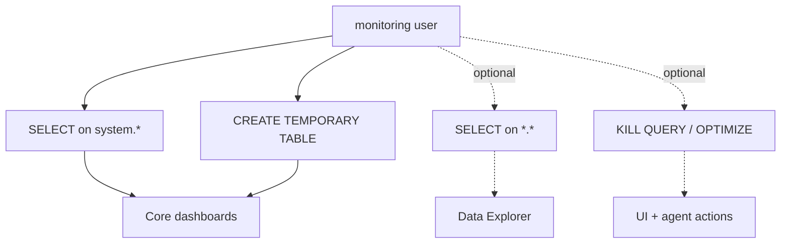

chmonitor needs a ClickHouse user with at minimum `SELECT` on `system.*`. Do not use an admin account for a shared dashboard. For `GRANT CREATE ON my_db.*` vs `GRANT CREATE TABLE`, `ON CLUSTER`, and `SHOW GRANTS`, see [ClickHouse GRANT syntax](/guide/guides/clickhouse-grant-syntax).

<Callout type="info" title="Connecting a firewalled ClickHouse to Cloud?">
If your ClickHouse is behind a firewall and you use the hosted Cloud, see
[Connect a firewalled ClickHouse](/guide/guides/connect-firewalled-clickhouse)
(Cloudflare Tunnel, dedicated egress IPs, or a jump host).
</Callout>



## Copy & paste: pick a permission level

Toggle the features you need — the SQL and XML output updates automatically. Replace `your-password` before running. The `monitoring_profile` body is in the [recommended profile](#recommended-clickhouse-profile) section below.

<GrantBuilder />

The static reference tabs below show every combination individually if you prefer to copy from them directly.

<Tabs items={['Read-only · SQL', 'Explorer · SQL', 'With actions · SQL', 'Read-only · XML', 'Explorer · XML', 'With actions · XML', 'Role-based · XML']}>

<Tab value="Read-only · SQL">
```sql
-- Monitoring dashboards only. Cannot kill queries, optimize, or mutate data.
CREATE USER monitoring
  IDENTIFIED WITH sha256_password BY 'your-password'
  HOST ANY;

-- All system tables (metrics, queries, merges, replicas, …)
GRANT SELECT ON system.* TO monitoring;

-- Required for some merge-aware queries
GRANT CREATE TEMPORARY TABLE ON *.* TO monitoring;
```
</Tab>

<Tab value="Explorer · SQL">
```sql
-- Monitoring dashboards + Data Explorer (query any table in any database).
-- SELECT ON *.* covers system.* as well — use only if you trust this account
-- to read all your databases.
CREATE USER monitoring
  IDENTIFIED WITH sha256_password BY 'your-password'
  HOST ANY;

GRANT SELECT ON *.* TO monitoring;
GRANT CREATE TEMPORARY TABLE ON *.* TO monitoring;
```
</Tab>

<Tab value="With actions · SQL">
```sql
-- Read-only monitoring, plus Kill Query and Optimize Table actions.
-- AGENT_ENABLE_CONTROL_TOOLS=true is also required for the AI agent to use these.
CREATE USER monitoring
  IDENTIFIED WITH sha256_password BY 'your-password'
  HOST ANY;

GRANT SELECT ON system.* TO monitoring;
GRANT CREATE TEMPORARY TABLE ON *.* TO monitoring;
GRANT KILL QUERY ON *.* TO monitoring;
GRANT OPTIMIZE ON *.* TO monitoring;
```
</Tab>

<Tab value="Read-only · XML">
```xml
<!-- /etc/clickhouse-server/users.d/monitoring.xml -->
<clickhouse>
  <users>
    <monitoring>
      <password_sha256_hex>REPLACE_WITH_SHA256_OF_YOUR_PASSWORD</password_sha256_hex>
      <networks><ip>::/0</ip></networks>
      <profile>monitoring_profile</profile>
      <grants>
        <query>GRANT SELECT ON system.*</query>
        <query>GRANT CREATE TEMPORARY TABLE ON *.*</query>
      </grants>
    </monitoring>
  </users>
</clickhouse>
```
Generate the hash: `echo -n 'your-password' | sha256sum`. See the [recommended profile](#recommended-clickhouse-profile) for the `monitoring_profile` body.
</Tab>

<Tab value="Explorer · XML">
```xml
<!-- /etc/clickhouse-server/users.d/monitoring.xml -->
<!-- SELECT ON *.* covers system.* and every user database. -->
<clickhouse>
  <users>
    <monitoring>
      <password_sha256_hex>REPLACE_WITH_SHA256_OF_YOUR_PASSWORD</password_sha256_hex>
      <networks><ip>::/0</ip></networks>
      <profile>monitoring_profile</profile>
      <grants>
        <query>GRANT SELECT ON *.*</query>
        <query>GRANT CREATE TEMPORARY TABLE ON *.*</query>
      </grants>
    </monitoring>
  </users>
</clickhouse>
```
Generate the hash: `echo -n 'your-password' | sha256sum`. Run `SYSTEM RELOAD CONFIG` or restart ClickHouse after editing.
</Tab>

<Tab value="With actions · XML">
```xml
<!-- /etc/clickhouse-server/users.d/monitoring.xml -->
<!-- Read-only monitoring, plus Kill Query and Optimize Table. -->
<clickhouse>
  <users>
    <monitoring>
      <password_sha256_hex>REPLACE_WITH_SHA256_OF_YOUR_PASSWORD</password_sha256_hex>
      <networks><ip>::/0</ip></networks>
      <profile>monitoring_profile</profile>
      <grants>
        <query>GRANT SELECT ON system.*</query>
        <query>GRANT CREATE TEMPORARY TABLE ON *.*</query>
        <query>GRANT KILL QUERY ON *.*</query>
        <query>GRANT OPTIMIZE ON *.*</query>
      </grants>
    </monitoring>
  </users>
</clickhouse>
```
Generate the hash: `echo -n 'your-password' | sha256sum`. `AGENT_ENABLE_CONTROL_TOOLS=true` is also required for the AI agent to use Kill Query / Optimize.
</Tab>

<Tab value="Role-based · XML">
Roles let you manage grants centrally and assign them to multiple users. Create the role via SQL first, then reference it from the user XML.

**Step 1 — create the role (run once in a ClickHouse client):**

```sql
CREATE ROLE IF NOT EXISTS monitoring_role;
GRANT SELECT ON system.* TO monitoring_role;
GRANT CREATE TEMPORARY TABLE ON *.* TO monitoring_role;

-- Optional: expand to Explorer or action support
-- GRANT SELECT ON *.* TO monitoring_role;
-- GRANT KILL QUERY ON *.* TO monitoring_role;
-- GRANT OPTIMIZE ON *.* TO monitoring_role;
```

**Step 2 — user config (`/etc/clickhouse-server/users.d/monitoring.xml`):**

```xml
<clickhouse>
  <users>
    <monitoring>
      <password_sha256_hex>REPLACE_WITH_SHA256_OF_YOUR_PASSWORD</password_sha256_hex>
      <networks><ip>::/0</ip></networks>
      <profile>monitoring_profile</profile>
      <grants>
        <query>GRANT monitoring_role TO monitoring</query>
      </grants>
    </monitoring>
  </users>
</clickhouse>
```

Generate the hash: `echo -n 'your-password' | sha256sum`. Run `SYSTEM RELOAD CONFIG` after editing the XML. Update grants on the role and they apply to all users holding it.
</Tab>

</Tabs>

## Optional extras

The tabs above already cover the three permission levels. Use these only if you need write-side extras.

<Accordions>
<Accordion title="Data Explorer (SELECT on every database)">
The Data Explorer lets you run SQL against any table, not just `system.*`:

```sql
GRANT SELECT ON *.* TO monitoring;
```

`SELECT ON *.*` is a superset of `SELECT ON system.*` — you do not need both.
</Accordion>
<Accordion title="Kill Query / Optimize Table">
```sql
GRANT KILL QUERY ON *.* TO monitoring;
GRANT OPTIMIZE ON *.* TO monitoring;
```

<Callout type="warn" title="Control tools are off by default">
`AGENT_ENABLE_CONTROL_TOOLS` must also be `true` for the AI agent to use kill/optimize. Keep it `false` on public or shared deployments.
</Callout>
</Accordion>
<Accordion title="Self-tracking events table">
chmonitor can write dashboard pageview events to ClickHouse (`system.monitoring_events` by default). Change `EVENTS_TABLE_NAME` to a table in your own database if you prefer not to write to `system.*`.

```sql
GRANT SELECT, INSERT
  ON your_database.monitoring_events
  TO monitoring;
```
</Accordion>
</Accordions>

## Per-feature grants checklist

`GRANT SELECT ON system.*` covers most of the dashboard. Missing optional tables show a notice, not an error.

<Accordions>
<Accordion title="Always required (SELECT ON system.*)">

| Dashboard feature | System tables used |
|---|---|
| Overview metrics | `system.metrics`, `system.asynchronous_metrics` |
| Running queries | `system.processes` |
| Active merges | `system.merges` |
| Replica status | `system.replicas` |
| Disks & storage | `system.disks`, `system.parts` |
| Tables list | `system.tables`, `system.columns` |
| Clusters | `system.clusters` |
| Mutations | `system.mutations` |
| Replication queue | `system.replication_queue` |
| Settings / users / roles | `system.settings`, `system.users`, `system.roles` |
| Warnings / errors | `system.warnings`, `system.errors` |
| Dictionaries | `system.dictionaries` |

</Accordion>
<Accordion title="Requires system.query_log (usually on)">

| Feature | Tables |
|---|---|
| Query history | `system.query_log` |
| Slow / expensive / failed queries | `system.query_log` |
| Common errors | `system.errors` |
| Top tables / columns by usage | `system.query_log` |

</Accordion>
<Accordion title="Optional — only when the subsystem exists">

| Feature | Required table | Notes |
|---|---|---|
| Query thread analysis | `system.query_thread_log` | Enable in server config |
| Query profiler | `system.processors_profile_log` | Enable in server config |
| Query views log | `system.query_views_log` | ClickHouse 22.4+ |
| Query cache | `system.query_cache` | ClickHouse 23.5+ |
| User processes | `system.user_processes` | ClickHouse 23.3+ |
| Merge performance / part log | `system.part_log` | Enable `part_log` |
| Query metric log | `system.query_metric_log` | Enable in server config |
| Detached parts | `system.detached_parts` | Always exists; may be empty |
| Dropped tables | `system.dropped_tables` | ClickHouse 23.x+ |
| Distributed DDL queue | `system.distributed_ddl_queue` | DDL via Keeper |
| Moves | `system.moves` | Tiered storage |
| Replicated fetches | `system.replicated_fetches` | Replicated clusters |
| View refreshes | `system.view_refreshes` | Refreshable MVs |
| Skip indexes (Explorer) | `system.data_skipping_indices` | ClickHouse 22.x+ |
| Login / sessions | `system.session_log` | Enable in server config |
| Text log | `system.text_log` | Enable `text_log` |
| Crash log | `system.crash_log` | Supported versions |
| **Backups** | `system.backup_log` | Only when backups are configured |
| **Error log** | `system.error_log` | Enable `error_log` |

</Accordion>
<Accordion title="Keeper / ZooKeeper (all optional)">

All Keeper pages are `optional: true` — they degrade to a notice when Keeper is not configured. `SELECT ON system.*` covers them.

| Feature | Required table | Notes |
|---|---|---|
| Keeper overview | `system.zookeeper_info` | Requires Keeper/ZooKeeper |
| Keeper connections | `system.zookeeper_connection` | Requires Keeper/ZooKeeper |
| Keeper watches | `system.zookeeper_watches` | Requires Keeper/ZooKeeper |
| Keeper log | `system.zookeeper_log` | Requires Keeper/ZooKeeper |
| Keeper connection log | `system.zookeeper_connection_log` | ClickHouse 25.8+ |
| ZooKeeper data browser | `system.zookeeper` | Requires Keeper/ZooKeeper |

</Accordion>
<Accordion title="Kafka + action grants">

| Feature | Required table | Notes |
|---|---|---|
| Kafka consumers | `system.kafka_consumers` | Only when Kafka engine tables exist |

| Action | Grant |
|---|---|
| Kill Query | `GRANT KILL QUERY ON *.* TO monitoring;` |
| Optimize Table | `GRANT OPTIMIZE ON *.* TO monitoring;` |
| Create temporary tables | `GRANT CREATE TEMPORARY TABLE ON *.* TO monitoring;` |

</Accordion>
</Accordions>

## Multi-host setup

Each host can have its own user and password. Comma-separated values share positions:

```bash
CLICKHOUSE_HOST=https://prod-a:8443,https://prod-b:8443
CLICKHOUSE_USER=monitoring,monitoring
CLICKHOUSE_PASSWORD=secret-a,secret-b
CLICKHOUSE_NAME=prod-a,prod-b
```

`CLICKHOUSE_HOST` defines the host count. `CLICKHOUSE_USER` and `CLICKHOUSE_PASSWORD` may be a single shared value or one value per host. `CLICKHOUSE_NAME` is optional.

## Recommended ClickHouse profile

<Files>
  <Folder name="etc/clickhouse-server/users.d" defaultOpen>
    <File name="monitoring.xml" />
    <File name="monitoring_profile.xml" />
  </Folder>
</Files>

```xml
<!-- /etc/clickhouse-server/users.d/monitoring_profile.xml -->
<clickhouse>
  <profiles>
    <monitoring_profile>
      <allow_experimental_analyzer>1</allow_experimental_analyzer>

      <!-- Optional: reduce repeated load from dashboard queries -->
      <use_query_cache>1</use_query_cache>
      <query_cache_ttl>50</query_cache_ttl>
      <query_cache_max_entries>0</query_cache_max_entries>
      <query_cache_system_table_handling>save</query_cache_system_table_handling>
      <query_cache_nondeterministic_function_handling>save</query_cache_nondeterministic_function_handling>
    </monitoring_profile>
  </profiles>

  <users>
    <monitoring>
      <profile>monitoring_profile</profile>
    </monitoring>
  </users>
</clickhouse>
```

## Related

<Cards>
  <Card
    title="Enable system tables"
    href="/guide/getting-started/clickhouse-enable-system-tables"
    description="Enable system log tables so every dashboard feature has data to read."
  />
  <Card
    title="Getting started"
    href="/guide/getting-started"
    description="Run chmonitor against your ClickHouse instance in minutes."
  />
  <Card
    title="Connect a firewalled ClickHouse"
    href="/guide/guides/connect-firewalled-clickhouse"
    description="Reach a firewalled ClickHouse from the hosted Cloud without a brittle IP allowlist."
  />
  <Card
    title="Environment variables"
    href="/reference/environment-variables"
    description="Every environment variable, grouped by category."
  />
</Cards>
