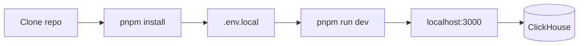

Run the dashboard from source to develop or test before deploy. The app is `apps/dashboard` (TanStack Start). Set `CHM_*` once; client `VITE_*` is derived.

<Cards>
  <Card title="ClickHouse user & grants" href="/guide/getting-started/clickhouse-requirements" description="Dedicated read-only user — do not use admin." />
  <Card title="Enable system tables" href="/guide/getting-started/clickhouse-enable-system-tables" description="query_log and friends for full pages." />
  <Card title="Environment variables" href="/reference/environment-variables" description="Every CHM_* / CLICKHOUSE_* name." />
</Cards>



## Steps

<Steps>

<Step>

### Clone the repo

```bash
git clone https://github.com/chmonitor/chmonitor
cd chmonitor
```

</Step>

<Step>

### Install dependencies

The project uses [pnpm](https://pnpm.io) (`pnpm@10.18.0`).

```bash
pnpm install
```

</Step>

<Step>

### Create `.env.local`

In `apps/dashboard/`:

<Files>
  <Folder name="apps/dashboard" defaultOpen>
    <File name=".env.example" />
    <File name=".env.local" />
  </Folder>
</Files>

```bash
# Required
CLICKHOUSE_HOST=http://localhost:8123
CLICKHOUSE_USER=monitoring
CLICKHOUSE_PASSWORD=your-password
```

<Callout type="warn" title="Never put secrets in VITE_* variables">
Set `CHM_*`. Client vars are inlined at build time.
</Callout>

</Step>

<Step>

### Configure ClickHouse hosts

Comma-separated lists configure multiple hosts; each `hostId` maps positionally.

<Tabs items={['One host', 'Multiple hosts']}>
<Tab value="One host">

```bash
CLICKHOUSE_HOST=http://localhost:8123
CLICKHOUSE_USER=monitoring
CLICKHOUSE_PASSWORD=your-password
```

</Tab>
<Tab value="Multiple hosts">

```bash
CLICKHOUSE_HOST=http://ch-1:8123,http://ch-2:8123,http://ch-3:8123
CLICKHOUSE_USER=monitoring,monitoring,monitoring
CLICKHOUSE_PASSWORD=pass-1,pass-2,pass-3
CLICKHOUSE_NAME=ch-1,ch-2,ch-3
```

</Tab>
</Tabs>

| Variable | Purpose |
|---|---|
| `CLICKHOUSE_HOST` | One or more URLs (`http://`/`https://`), optionally `host:port`. |
| `CLICKHOUSE_USER` | Comma-separated user(s); a single value applies to every host. |
| `CLICKHOUSE_PASSWORD` | Comma-separated password(s); a single value applies to every host. |
| `CLICKHOUSE_NAME` | Display names for the host switcher. |
| `CLICKHOUSE_DATABASE` | Default database (default `system`). |
| `CLICKHOUSE_MAX_EXECUTION_TIME` | Query timeout in seconds (default `60`). |
| `CLICKHOUSE_TZ` | Session timezone for queries. |
| `CLICKHOUSE_EXCLUDE_USER_DEFAULT` | Hide the `default` user from the UI when set. |

Host `0` is the first `CLICKHOUSE_HOST` entry (`?host=0`). The user needs the grants in the next step.

</Step>

<Step>

### Configure Postgres hosts (optional)

Postgres is a beta **source engine** — off by default.

<Accordions>
<Accordion title="Postgres env (feature flag + positional hosts)">

```bash
CHM_FEATURE_POSTGRES_SOURCE=true

# One host
POSTGRES_HOST=db.example.com
POSTGRES_PORT=5432
POSTGRES_USER=chmonitor_ro
POSTGRES_PASSWORD=my-password
POSTGRES_DATABASE=postgres
POSTGRES_SSLMODE=require
POSTGRES_NAME=Production Postgres

# Multiple (comma-separated, positional)
POSTGRES_HOST=db-1:5432,db-2:5432
POSTGRES_USER=ro,ro
POSTGRES_PASSWORD=p1,p2
POSTGRES_NAME=pg-1,pg-2
```

| Variable | Purpose |
|---|---|
| `CHM_FEATURE_POSTGRES_SOURCE` | Master switch. Default `false`. |
| `POSTGRES_HOST` | Hosts, optionally `host:port`. |
| `POSTGRES_PORT` | Default `5432` when no inline port. |
| `POSTGRES_USER` / `POSTGRES_PASSWORD` | Positional; a single value applies to every host. |
| `POSTGRES_DATABASE` | Default `postgres`. |
| `POSTGRES_SSLMODE` | `disable` / `require` / `verify-ca` / `verify-full`. |
| `POSTGRES_NAME` | Host switcher labels. |
| `CHM_ALLOW_PRIVATE_HOSTS` | Allow `localhost`/private addresses for local dev (ignored in Cloud). |

Use a dedicated **read-only** role — chmonitor pins `default_transaction_read_only=on`. Query Insights needs `pg_stat_statements`; Running Queries needs `pg_stat_activity`. See the [Postgres feature guide](/guide/features/postgres).

</Accordion>
</Accordions>

</Step>

<Step>

### Configure ClickHouse grants

- [ClickHouse user & grants](/guide/getting-started/clickhouse-requirements)
- [Enable system tables](/guide/getting-started/clickhouse-enable-system-tables)

</Step>

<Step>

### Start the dev server

```bash
cd apps/dashboard
pnpm run dev
```

Open [http://localhost:3000](http://localhost:3000).

</Step>

</Steps>

## Verify

The dashboard hot-reloads as you edit. Overview should show live metrics from ClickHouse.

## Troubleshooting

<Accordions>
<Accordion title="localhost connection refused">
If ClickHouse is not running locally, point `CLICKHOUSE_HOST` at your remote instance.
</Accordion>
<Accordion title="Type errors on first run">
Run `pnpm run type-check` from the repo root. Some generated types need a build pass first.
</Accordion>
<Accordion title="Missing system tables">
See [Enable system tables](/guide/getting-started/clickhouse-enable-system-tables).
</Accordion>
</Accordions>

## Related

<Cards>
  <Card title="Getting started" href="/guide/getting-started" description="Run chmonitor against your ClickHouse instance in minutes." />
  <Card title="ClickHouse user & grants" href="/guide/getting-started/clickhouse-requirements" description="Create a safe read-only monitoring user." />
  <Card title="Enable system tables" href="/guide/getting-started/clickhouse-enable-system-tables" description="Enable system log tables for full coverage." />
  <Card title="Install & configure" href="/operate/deploy" description="Deploy to Kubernetes, Cloudflare Workers, or Docker." />
</Cards>
