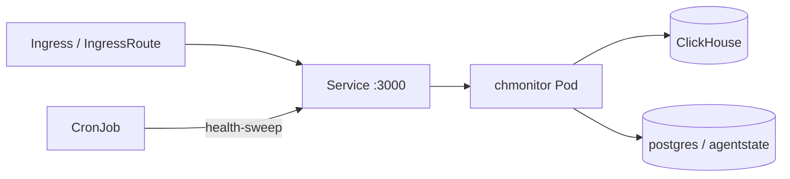

Run chmonitor on Kubernetes with the vendored Helm chart or raw kustomize manifests. Same image (`ghcr.io/chmonitor/chmonitor:X.Y.Z`), port `3000`, non-root `app` user (uid/gid `1001`), same health probes.


```mermaid
flowchart LR
  I[Ingress / IngressRoute] --> S[Service :3000]
  S --> P[chmonitor Pod]
  P --> CH[(ClickHouse)]
  P --> DB[(postgres / agentstate)]
  CJ[CronJob] -->|health-sweep| S
```

## Prerequisites

- A Kubernetes cluster and `kubectl` context.
- Helm 3 (chart) or `kubectl` + kustomize (raw manifests).
- A reachable ClickHouse endpoint with a monitoring user.

| Registry | Install command |
|----------|----------------|
| **Helm repo** (Cloudflare Pages) | `helm repo add chmonitor https://charts.chmonitor.dev` |
| **OCI** (GHCR) | `helm install my-chm oci://ghcr.io/chmonitor/chmonitor --version X.Y.Z` |

## Setup

<Tabs items={["Helm repo", "Helm OCI", "Helm from source", "kustomize"]}>
<Tab value="Helm repo">

<Steps>
<Step>
### Add the repo and install

```bash
helm repo add chmonitor https://charts.chmonitor.dev
helm repo update

helm install my-chm chmonitor/chmonitor \
  --set clickhouse.host="https://clickhouse.example.com:8443" \
  --set clickhouse.user="monitoring" \
  --set clickhouse.password="change-me"
```
</Step>

<Step>
### Install with a values file (optional)

```bash
helm install my-chm chmonitor/chmonitor -f values.yaml
```

```yaml
image:
  tag: "X.Y.Z"   # latest tag: https://github.com/chmonitor/chmonitor/releases

clickhouse:
  host: "https://clickhouse.example.com:8443"
  user: "monitoring"
  password: "change-me"

ingress:
  enabled: true
  className: nginx
  hosts:
    - host: chmonitor.example.com
      paths:
        - path: /
          pathType: Prefix

resources:
  requests:
    cpu: 100m
    memory: 256Mi
  limits:
    cpu: 500m
    memory: 512Mi
```
</Step>
</Steps>

```bash
helm upgrade my-chm chmonitor/chmonitor -f values.yaml
helm uninstall my-chm
```

</Tab>
<Tab value="Helm OCI">

Replace `X.Y.Z` with the chart version from [GitHub Releases](https://github.com/chmonitor/chmonitor/releases).

```bash
helm install my-chm oci://ghcr.io/chmonitor/chmonitor --version X.Y.Z \
  --set clickhouse.host="https://clickhouse.example.com:8443" \
  --set clickhouse.user="monitoring" \
  --set clickhouse.password="change-me"
```

```bash
helm pull oci://ghcr.io/chmonitor/chmonitor --version X.Y.Z --untar
helm show values ./chmonitor
```

</Tab>
<Tab value="Helm from source">

Clone and install the chart when you need to patch it first:

```bash
git clone https://github.com/chmonitor/chmonitor.git
cd chmonitor

helm install my-chm ./deploy/helm/chmonitor \
  --set clickhouse.host="https://clickhouse.example.com:8443" \
  --set clickhouse.user="monitoring" \
  --set clickhouse.password="change-me"
```

</Tab>
<Tab value="kustomize">

```bash
kubectl kustomize deploy/kubernetes/base
kubectl apply -k deploy/kubernetes/base
kubectl port-forward svc/chmonitor 3000:3000
```

Keep environment differences in an overlay:

```yaml
# deploy/kubernetes/overlays/prod/kustomization.yaml
apiVersion: kustomize.config.k8s.io/v1beta1
kind: Kustomization
namespace: monitoring
resources:
  - ../../base
images:
  - name: ghcr.io/chmonitor/chmonitor
    newTag: X.Y.Z
replicas:
  - name: chmonitor
    count: 2
```

</Tab>
</Tabs>

## Verify

```bash
kubectl port-forward svc/my-chm-chmonitor 3000:3000
# open http://localhost:3000
```

## Configure

Required: `CLICKHOUSE_HOST`, `CLICKHOUSE_USER`, `CLICKHOUSE_PASSWORD` (Secret, not ConfigMap).

Helm `values.yaml` `clickhouse.*` maps to those names. Extra flags: `extraEnv` — copy names from
[`apps/dashboard/.env.example`](https://github.com/chmonitor/chmonitor/blob/main/apps/dashboard/.env.example).
Full list: [Environment variables](/reference/environment-variables).
Auth: [Authentication](/operate/authentication).

```bash
kubectl create secret generic chmonitor-clickhouse \
  --from-literal=CLICKHOUSE_HOST='https://clickhouse.example.com:8443' \
  --from-literal=CLICKHOUSE_USER='monitoring' \
  --from-literal=CLICKHOUSE_PASSWORD='change-me'
```

<Callout type="warn" title="Clerk / dual-surface flags">
`CHM_AUTH_PROVIDER` and `CHM_CLERK_PUBLISHABLE_KEY` must be present at **image build** time. The published GHCR image is auth `none`.
</Callout>

### Feature permissions from a ConfigMap

The dashboard reads `CHM_CONFIG_FILE` once at startup, so a mounted ConfigMap
can hold the [feature-permission](/operate/advanced/feature-permissions) file.
Env vars still win over the file; a missing or invalid file is ignored with a
warning, never a crash. Restart the pods to pick up a changed ConfigMap.

```bash
kubectl create configmap chmonitor-config --from-file=config.toml
```

Mount it into the pod (the chart has no volume values yet, so use a
post-renderer or your own manifest) and point the env var at it:

```yaml
extraEnv:
  - name: CHM_CONFIG_FILE
    value: /etc/clickhouse-monitor/config.toml
# pod spec: volume from ConfigMap "chmonitor-config",
# mounted read-only at /etc/clickhouse-monitor
```

### Alert definitions from a ConfigMap

You can run alerting on Kubernetes with no metadata database. Declare the
definitions in a ConfigMap and the secrets in a Secret. Definitions are
declarative; alert state and ACKs are not, so without D1 or Postgres alert state
is in memory, resets on pod restart, and Acknowledge is disabled. Read the
[read-only/writable boundary](/guide/features/health#run-alerts-without-a-metadata-database)
first.

<Steps>
<Step>
Write one YAML file per concern (`alerts.yaml`, `routing.yaml`, `channels.yaml`,
`quiet-hours.yaml`, `maintenance.yaml`, `digest.yaml`). File formats and
examples are in [Health](/guide/features/health#the-files). Then create the
ConfigMap from the directory:

```bash
kubectl create configmap chmonitor-health --from-file=health.d/
```
</Step>
<Step>
Put every secret in a Secret. The YAML only names the variable
(`secretEnv`, `urlEnv`, `headersEnv`); a ConfigMap is not a Secret.

```bash
kubectl create secret generic chmonitor-alert-secrets \
  --from-literal=CHM_ROUTE_PAGERDUTY_KEY='<routing-key>' \
  --from-literal=CHM_WEBHOOK_OPS_CHAT_URL='https://hooks.slack.com/services/...'
```
</Step>
<Step>
Expose those keys as env vars with `secretKeyRef`, and mount the ConfigMap at
`/etc/chmonitor/health.d`, the default directory. The chart has no volume values
yet, so add the volume with a post-renderer or your own manifest. Set
`CHM_HEALTH_CONFIG_DIRECTORY` only if you mount somewhere else.

```yaml
# values.yaml
extraEnv:
  - name: CHM_ROUTE_PAGERDUTY_KEY
    valueFrom:
      secretKeyRef:
        name: chmonitor-alert-secrets
        key: CHM_ROUTE_PAGERDUTY_KEY
  - name: CHM_WEBHOOK_OPS_CHAT_URL
    valueFrom:
      secretKeyRef:
        name: chmonitor-alert-secrets
        key: CHM_WEBHOOK_OPS_CHAT_URL
```

```yaml
# pod spec (post-renderer / own manifest)
volumes:
  - name: health-d
    configMap:
      name: chmonitor-health
containers:
  - name: chmonitor
    volumeMounts:
      - name: health-d
        mountPath: /etc/chmonitor/health.d
        readOnly: true
```
</Step>
<Step>
Restart the pods. The directory is read once per process, so a changed
ConfigMap needs `kubectl rollout restart deployment/chmonitor`. Then open
**Health → Settings**: declared entries show a **Config file** badge and are
read-only.
</Step>
</Steps>

Bad entries never stop the pod: they are skipped with a warning in the pod log
that names the file and entry, never a value. Check
`GET /api/v1/config` (`capabilities.health`) to see which store backend the pod
resolved.

## Health probes

| Probe | Path | Behavior |
|---|---|---|
| **Liveness** | `GET /healthz` | Always `200` while the process runs |
| **Readiness** | `GET /api/healthz` | `503` when no ClickHouse host is reachable |

## Autoscaling

```yaml
autoscaling:
  enabled: true
  minReplicas: 2
  maxReplicas: 10
  targetCPUUtilizationPercentage: 80
```

The dashboard is stateless. Readiness keeps traffic off pods until ClickHouse is reachable.

## Secrets management

Do not commit real passwords. Use:

- [External Secrets](https://external-secrets.io/) — AWS / GCP / Vault
- [SOPS](https://github.com/getsops/sops) — encrypt in Git
- [Sealed Secrets](https://sealed-secrets.netlify.app/) — encrypt for one cluster

## Upgrading

<Steps>
<Step>
### Update the image tag

In `values.yaml` or the kustomize overlay.
</Step>

<Step>
### Apply the change

```bash
# Helm
helm upgrade my-chm ./deploy/helm/chmonitor -f values.yaml

# kustomize
kubectl apply -k deploy/kubernetes/overlays/prod
```
</Step>

<Step>
### Verify the rollout

```bash
kubectl rollout status deployment/chmonitor
```
</Step>
</Steps>

For breaking changes, see [Migrating to v0.3](/reference/migrating/v0-3).

## Troubleshooting

Validate before applying:

```bash
helm lint ./deploy/helm/chmonitor
helm template release ./deploy/helm/chmonitor | kubeconform -strict -summary
kubectl kustomize deploy/kubernetes/base | kubeconform -strict -summary
```

## Related

<Cards>
  <Card title="Production checklist" href="/operate/deploy/production-checklist" description="Harden and validate before going live." />
  <Card title="Authentication" href="/operate/authentication" description="Configure none / clerk / proxy auth providers." />
  <Card title="Docker" href="/operate/deploy/docker" description="Single-container self-host on one server." />
  <Card title="Migrating to v0.3" href="/reference/migrating/v0-3" description="Breaking changes between major versions." />
</Cards>

Walkthrough: [Deploy chmonitor on Kubernetes with Helm](https://blog.chmonitor.dev/self-hosting-chmonitor-helm/).
