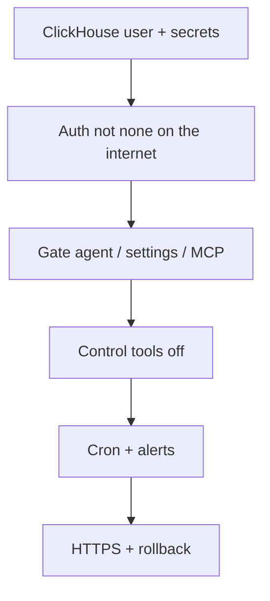

Work through each section before exposing chmonitor to a team or the internet. Skipping an item leaves a gap.

<Accordions>
<Accordion title="ClickHouse user and grants">

- [ ] Dedicated monitoring user — not `default` or admin.
- [ ] Grant `SELECT` on `system.*` only. Dashboard is read-only by default.
- [ ] If you enable kill-query, also grant `KILL QUERY`.
- [ ] Set `CLICKHOUSE_MAX_EXECUTION_TIME` (e.g. `30`) so runaway dashboard queries stop.
- [ ] Store `CLICKHOUSE_PASSWORD` in a secret (Docker / k8s / Worker / Vercel) — never source or ConfigMap.
- [ ] Prefer HTTPS for ClickHouse Cloud and public endpoints. Keep private endpoints on your network.

</Accordion>
<Accordion title="Authentication — do not leave fully public">

<Callout type="danger" title="Open access is not safe on the internet">
`CHM_AUTH_PROVIDER=none` is only safe on a private network with no agent or MCP access. If chmonitor is reachable from the internet, use Clerk or a trusted-header proxy.
</Callout>

- [ ] Choose an auth provider: `none` only on a private network with no agent or MCP.
- [ ] If `CHM_AUTH_PROVIDER=none`, restrict network access so the app is not on the internet.
- [ ] For teams, use Clerk or a trusted-header proxy.
- [ ] Set `CHM_API_KEY_SECRET` whenever you expose `/api/mcp`. MCP clients send long-lived tokens. The endpoint returns 401 by default; `CHM_MCP_PUBLIC=true` only on isolated private networks.
- [ ] Rotate `CHM_API_KEY_SECRET` and `CHM_PROXY_AUTH_SECRET` if exposed. Redeploy after rotating.
- [ ] Never put `CLERK_SECRET_KEY`, `LLM_API_KEY`, or `CHM_API_KEY_SECRET` in `VITE_*` or `NEXT_PUBLIC_*` — those bake into browser JS.

</Accordion>
<Accordion title="Feature permissions — gate sensitive features">

- [ ] Gate the agent: `CHM_FEATURE_AGENT_ACCESS=authenticated`.
- [ ] Gate settings: `CHM_FEATURE_SETTINGS_ACCESS=authenticated` or `CHM_FEATURE_SETTINGS_ENABLED=false`.
- [ ] Gate MCP: `CHM_FEATURE_MCP_ACCESS=authenticated`.
- [ ] Disable unused features: `CHM_DISABLED_FEATURES=actions,peerdb`.
- [ ] Review what unauthenticated users see. Default is all public.

</Accordion>
<Accordion title="AI agent">

- [ ] Keep `AGENT_ENABLE_CONTROL_TOOLS=false` unless you trust all authenticated users to kill queries and optimize tables.
- [ ] Keep `LLM_API_KEY` server-side only.
- [ ] Set `AGENT_API_TOKEN` to gate `/api/v1/agent`.
- [ ] The agent uses the ClickHouse user's grants. A read-only user limits what it can do.
- [ ] Set spending / rate limits on the LLM provider.

</Accordion>
<Accordion title="Health alerting">

- [ ] Set `CRON_SECRET` to protect `/api/cron/health-sweep`.
- [ ] Set `HEALTH_ALERT_ENABLED=true` and `HEALTH_ALERT_WEBHOOK_URL` (Slack or Discord).
- [ ] Choose `HEALTH_ALERT_MIN_SEVERITY=warning` or `critical`.
- [ ] Verify the cron trigger (Cloudflare Cron, k8s CronJob, or external cron).

</Accordion>
<Accordion title="Query timeout and pool">

- [ ] Set `CLICKHOUSE_MAX_EXECUTION_TIME` below your request timeout (30 s is a safe default).
- [ ] Tune `CLICKHOUSE_POOL_SIZE` to concurrent dashboard users.

</Accordion>
<Accordion title="Conversation store backups">

- [ ] If using postgres, clickhouse, or D1, include it in backups.
- [ ] D1: `wrangler d1 export`.
- [ ] postgres: provider backups.
- [ ] `memory` and `local` (browser localStorage) are ephemeral.

</Accordion>
<Accordion title="Network and deployment">

- [ ] The app can reach ClickHouse from the **runtime**, not just your laptop.
- [ ] HTTPS in front of chmonitor (nginx, Cloudflare, or load balancer).
- [ ] Record where secrets live and who can rotate them.
- [ ] Rollback path: previous Docker tag, Helm revision, or Worker version.
- [ ] Watch logs after deploy for connection or auth failures.

</Accordion>
</Accordions>

## Related

<Cards>
  <Card title="Authentication" href="/operate/authentication" description="Choose and configure an auth provider: none, API key, Clerk, or trusted proxy." />
  <Card title="Docker deployment" href="/operate/deploy/docker" description="Full env var reference for a self-hosted container." />
  <Card title="Cloudflare Workers" href="/operate/deploy/cloudflare" description="Serverless hosting with D1 and Cron Trigger support." />
  <Card title="Kubernetes deployment" href="/operate/deploy/k8s" description="Install chmonitor with the Helm chart, secrets, and probes." />
</Cards>
