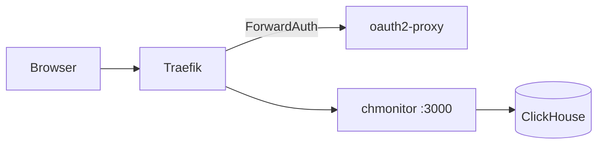

Run chmonitor behind [Traefik](https://traefik.io/) as reverse proxy / ingress. Same pattern on Kubernetes (IngressRoute or Ingress) and Docker (container labels).

Traefik handles TLS, routing, and — with [oauth2-proxy](/operate/authentication/trusted-proxy) — authentication. chmonitor can stay on `none` and trust the forwarded identity.



## Prerequisites

<Callout type="info" title="What you need">
- A running Traefik instance (ingress controller or Docker provider)
- chmonitor via [Helm](/operate/deploy/k8s) or [Docker](/operate/deploy/docker)
- For SSO: [oauth2-proxy](/operate/authentication/trusted-proxy) (Dex, Google, GitHub, …)
</Callout>

## Setup

chmonitor listens on port `3000`.

<Tabs items={["Kubernetes (IngressRoute)", "Kubernetes (Ingress)", "Docker (labels)"]}>
<Tab value="Kubernetes (IngressRoute)">

If you installed with the [Helm chart](/operate/deploy/k8s), expose the Service with an `IngressRoute`:

```yaml
apiVersion: traefik.io/v1alpha1
kind: IngressRoute
metadata:
  name: chmonitor
  namespace: monitoring
spec:
  entryPoints:
    - websecure
  routes:
    - match: Host(`chmonitor.example.com`)
      kind: Rule
      services:
        - name: chmonitor          # chart Service name
          port: 3000               # service.port (default 3000)
  tls:
    certResolver: letsencrypt      # or tls.secretName
```
</Tab>

<Tab value="Kubernetes (Ingress)">

Prefer standard `Ingress`? Enable it in the chart:

```yaml
# values.yaml
ingress:
  enabled: true
  className: traefik
  hosts:
    - host: chmonitor.example.com
      paths:
        - path: /
          pathType: Prefix
  tls:
    - hosts: [chmonitor.example.com]
      secretName: chmonitor-tls
```
</Tab>

<Tab value="Docker (labels)">

With Compose and Traefik watching Docker:

```yaml
services:
  chmonitor:
    image: ghcr.io/chmonitor/chmonitor:latest
    environment:
      CLICKHOUSE_HOST: http://clickhouse:8123
      CLICKHOUSE_USER: default
      CLICKHOUSE_PASSWORD: ""
    labels:
      - traefik.enable=true
      - traefik.http.routers.chmonitor.rule=Host(`chmonitor.example.com`)
      - traefik.http.routers.chmonitor.entrypoints=websecure
      - traefik.http.routers.chmonitor.tls.certresolver=letsencrypt
      - traefik.http.services.chmonitor.loadbalancer.server.port=3000
```
</Tab>
</Tabs>

### Authentication via ForwardAuth

Put chmonitor behind oauth2-proxy using Traefik `ForwardAuth`, and read identity with the [`trusted` auth provider](/operate/authentication/trusted-proxy).

<Steps>
<Step>
### Define the ForwardAuth middleware

```yaml
apiVersion: traefik.io/v1alpha1
kind: Middleware
metadata:
  name: oauth2-proxy-auth
  namespace: monitoring
spec:
  forwardAuth:
    address: http://oauth2-proxy.monitoring.svc.cluster.local/oauth2/auth
    trustForwardHeader: true
    authResponseHeaders:
      - X-Auth-Request-User
      - X-Auth-Request-Email
      - X-Auth-Request-Preferred-Username
      - X-Auth-Request-Groups
```
</Step>

<Step>
### Attach the middleware to the route

Add `middlewares: [{ name: oauth2-proxy-auth }]` on the IngressRoute, or `traefik.http.routers.chmonitor.middlewares=...` on Docker.
</Step>

<Step>
### Configure chmonitor's trusted provider

```bash
CHM_AUTH_PROVIDER=trusted
# oauth2-proxy forwards X-Auth-Request-* (not X-Forwarded-*)
CHM_TRUSTED_USER_HEADER=X-Auth-Request-User
CHM_TRUSTED_EMAIL_HEADER=X-Auth-Request-Email
CHM_TRUSTED_NAME_HEADER=X-Auth-Request-Preferred-Username
CHM_TRUSTED_GROUPS_HEADER=X-Auth-Request-Groups
# Restrict to Dex groups (optional)
CHM_TRUSTED_ALLOWED_GROUPS=sre,platform-admins
```
</Step>
</Steps>

See [Trusted proxy](/operate/authentication/trusted-proxy) for headers, shared-secret vs `CHM_TRUSTED_ALLOW_INSECURE`, and Dex/oauth2-proxy flags.

## Verify

chmonitor exposes `/healthz` (liveness, static) and `/api/healthz` (readiness, ClickHouse-gated). Traefik can health-check:

```yaml
services:
  - name: chmonitor
    port: 3000
    healthCheck:
      path: /healthz
      intervalSeconds: 15
```

<Callout type="warn" title="Don't guard health endpoints with ForwardAuth">
Do **not** put ForwardAuth on `/healthz` and `/api/healthz`, or probes redirect to login. Use a higher-priority router without auth, or the chart's Kubernetes probes (hit the pod, bypass Traefik).
</Callout>

## Troubleshooting

<Accordions>
<Accordion title="Probes redirected to login">
ForwardAuth is guarding `/healthz` / `/api/healthz`. Route those paths without the auth middleware, or use the chart's pod probes.
</Accordion>
</Accordions>

## Related

<Cards>
  <Card title="Kubernetes deployment" href="/operate/deploy/k8s" description="Install chmonitor with the Helm chart." />
  <Card title="Docker deployment" href="/operate/deploy/docker" description="Run the published container behind Traefik's Docker provider." />
  <Card title="Trusted proxy authentication" href="/operate/authentication/trusted-proxy" description="Header reference, shared-secret tradeoff, and Dex/oauth2-proxy flags." />
  <Card title="Authentication overview" href="/operate/authentication" description="Choose an auth provider for chmonitor." />
  <Card title="Production checklist" href="/operate/deploy/production-checklist" description="Harden and validate before exposing to a team or the internet." />
</Cards>
