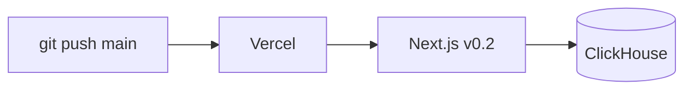

Deploy chmonitor to Vercel using the **legacy Next.js** build. Vercel auto-deploys on push to `main` and inlines client env at build time.

<Callout type="warn" title="Legacy guide — Next.js v0.2 only">
This guide targets the **legacy Next.js build (v0.2 and earlier)**. The current app (`apps/dashboard`, TanStack Start, v0.3+) is designed for Cloudflare Workers. If you run v0.3+, use [Cloudflare Workers](/operate/deploy/cloudflare) or [Docker](/operate/deploy/docker).
</Callout>

## Prerequisites

<Callout type="info" title="What you need">
- A Vercel account
- Node.js 22.x or later (build runtime)
- A reachable ClickHouse endpoint with a monitoring user
</Callout>

## Setup

Use the one-click button, or follow the manual steps.

<Steps>
<Step>
### Import the repo

Go to [vercel.com/new](https://vercel.com/new) and import the repository.
</Step>

<Step>
### Set build settings

Vercel detects Next.js automatically.

| Setting | Value |
|---|---|
| Framework preset | Next.js |
| Build command | `pnpm run build` (or `npm run build`) |
| Output directory | `.next` |
| Install command | `pnpm install` |
| Node.js version | 22.x or later |
</Step>

<Step>
### Set environment variables

**Project → Settings → Environment Variables** — see [Configure](#configure).
</Step>

<Step>
### Deploy

Click **Deploy** or push to `main`.
</Step>
</Steps>

### Configure

Required: `CLICKHOUSE_HOST`, `CLICKHOUSE_USER`, `CLICKHOUSE_PASSWORD`.

Set `CHM_*` once ([Environment variables](/reference/environment-variables)).
Do not set `VITE_*` or `NEXT_PUBLIC_*` as operator config — the current app is TanStack Start.

Template: [`apps/dashboard/.env.example`](https://github.com/chmonitor/chmonitor/blob/main/apps/dashboard/.env.example).

## Verify

- Open the Vercel URL — overview should load.
- Upgrade: push to `main` (or merge). Env changes: update in the dashboard, then **Deployments → Redeploy**.

For breaking changes, see [Migrating to v0.3](/reference/migrating/v0-3).

## Troubleshooting

<Accordions>
<Accordion title="No D1 / Durable Objects">
Cloudflare-only. Use postgres or clickhouse for conversation store.
</Accordion>
<Accordion title="Function timeout">
Hobby plan limits functions to 10 s. Use Pro or set `CLICKHOUSE_MAX_EXECUTION_TIME` below that.
</Accordion>
<Accordion title="Cold starts">
Tune `CLICKHOUSE_POOL_SIZE` for serverless cold starts.
</Accordion>
</Accordions>

## Related

<Cards>
  <Card title="Cloudflare Workers" href="/operate/deploy/cloudflare" description="The current v0.3+ deployment target — serverless, global, D1 and Cron support." />
  <Card title="Docker" href="/operate/deploy/docker" description="Run the published container anywhere Docker runs." />
  <Card title="Authentication" href="/operate/authentication" description="Choose an auth provider: none, API key, Clerk, or trusted proxy." />
  <Card title="Migrating to v0.3" href="/reference/migrating/v0-3" description="Breaking changes between major versions." />
  <Card title="Production checklist" href="/operate/deploy/production-checklist" description="Harden and validate before exposing to a team or the internet." />
</Cards>
